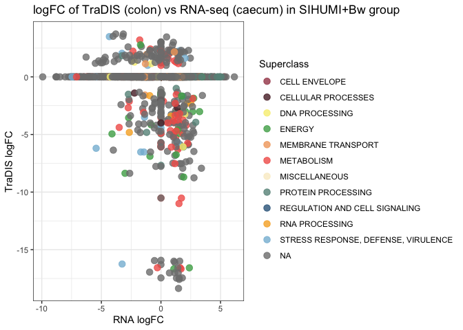
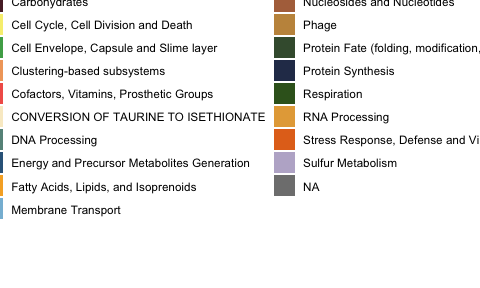
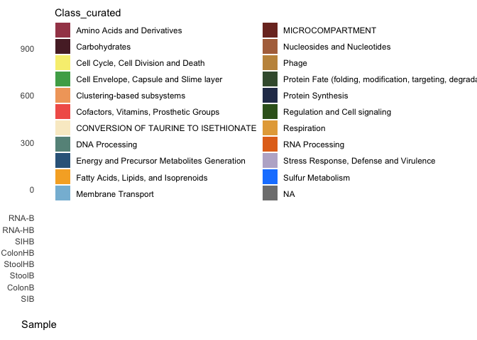

Calculation of no. genes that are essential in the gut and that are
expressed
================

Load libraries and set directory

Put together the data in data frames and clean

``` r
bins=read_xlsx("~/PATH/OVERVIEW_filtered_logfc3.xlsx", range = "B3:P839",  sheet="filtered_logfc_HF_PAT")
```

    ## New names:
    ## • `Bw` -> `Bw...2`
    ## • `SIHUMI+Bw` -> `SIHUMI+Bw...3`
    ## • `Bw` -> `Bw...4`
    ## • `SIHUMI+Bw` -> `SIHUMI+Bw...5`
    ## • `Bw` -> `Bw...6`
    ## • `SIHUMI+Bw` -> `SIHUMI+Bw...7`

``` r
colnames(bins) <- c("Locus tag", "SIB", "SIHB", "ColonB", "ColonHB", "StoolB", "StoolHB", "RNA-B", "RNA-HB", "Superclass", "Class", "Class_curated", "Subclass", "Subsystem", "Product PATRIC")

Tradis <- bins[,1:7]
```

``` r
Transcriptome=read_xlsx("/PATH/OVERVIEW_filtered_logfc3.xlsx", range = "A3:D2856",  sheet="Degustaug24")

Annotation= read_xlsx("/PATH/OVERVIEW_filtered_logfc3.xlsx", range ="C1:I4583", sheet = "PATRIC_TO_NCBI")


# First merge Transcriptome with Tradis
temp_merge <- merge(Transcriptome, Tradis, by = c("Locus tag"), all = TRUE)

# Then merge the result with Annotation
Tradis_RNA <- merge(temp_merge, Annotation, by = c("Locus tag"), all = TRUE)


#add 0 to all the genes that were not present in one of the tables (e.g. Tradis or RNA-seq)
# List of columns to replace NA with 0
columns_to_replace <- c("log FC Gavage vs Caecum of Bw mice group", 
                        "log FC Gavage vs Caecum of SIHUMI+Bw mice group",
                        "SIB", "SIHB", "ColonB", "ColonHB", "StoolB", "StoolHB")

# Loop through each column and replace NA with 0
for (col in columns_to_replace) {
  Tradis_RNA[[col]][is.na(Tradis_RNA[[col]])] <- 0
}
```

Now look for the genes that are expressed and that are essential and
expressed. This information was included in the manuscript.

``` r
## 162 genes are essential in any gut condition and overexpressed in the caecum compared to in vitro conditions
HuB_essential_and_expressed <- subset (Tradis_RNA, `log FC Gavage vs Caecum of SIHUMI+Bw mice group` > 0 & c(SIHB <0 | StoolHB <0 | ColonHB <0 ))


##In contrast, 72 genes are essential in any gut condition and overexpressed in the caecum compared to in vitro conditions
B_essential_and_expressed <- subset (Tradis_RNA, `log FC Gavage vs Caecum of Bw mice group` >0 & c(SIB <0 | StoolB <0 | ColonB <0 ))
```

``` r
#Genes that had a higher mutation in the colon compared to in vitro, but that were expressed 
HuB_high_mutation_and_expressed <- subset (Tradis_RNA, ColonHB >0 & `log FC Gavage vs Caecum of SIHUMI+Bw mice group` >0)


##show which genes are important in HuB but not in B
difference <-setdiff (HuB_essential_and_expressed$`Locus tag`, B_essential_and_expressed$`Locus tag` )
difference <-Tradis_RNA[which ( Tradis_RNA$`Locus tag` %in% difference),]


#Genes that are important only with Bw compared to SIHUMI+Bw
difference2 <-setdiff (B_essential_and_expressed$`Locus tag` , HuB_essential_and_expressed$`Locus tag`)
difference2 <-Tradis_RNA[which ( Tradis_RNA$`Locus tag` %in% difference2),]

colours = c( "#A54657",  "#582630", "#F7EE7F", "#4DAA57","#F1A66A","#F26157", "#F9ECCC", "#679289", "#33658A",
             "#F6AE2D","#86BBD8",   "#7d3127", "#b1704a", "#c4944b", "#405a3b", "#2b3958", "#386122", "#e5a946", "#e3711d", "#bcb3cf", "#1A85FF", "#D41159", "#FFC20A", "#D35FB7")

#plot the Tradis logFC of SIHUMI+Bw in colon vs expression. The logFC in TraDIS <0 means more important in the gut. The logFC >0 will be more expressed in the gut compared to in vitro
p1<-ggplot (Tradis_RNA, aes(y=ColonHB, x=Tradis_RNA$`log FC Gavage vs Caecum of SIHUMI+Bw mice group`))+ 
  geom_point(size = 3, alpha = 0.8, aes (colour=Superclass)) +
 scale_color_manual(values = colours) +
  theme_bw() + labs(x="RNA logFC", y="TraDIS logFC")+
  ggtitle("logFC of TraDIS (colon) vs RNA-seq (caecum) in SIHUMI+Bw group")

p1
```

    ## Warning: Use of `` Tradis_RNA$`log FC Gavage vs Caecum of SIHUMI+Bw mice group` `` is
    ## discouraged.
    ## ℹ Use `log FC Gavage vs Caecum of SIHUMI+Bw mice group` instead.

<!-- -->

``` r
p2<-ggplot (Tradis_RNA, aes(y=ColonB, x=Tradis_RNA$`log FC Gavage vs Caecum of Bw mice group`))+ 
  geom_point(size = 3, alpha = 0.8, aes (colour=Superclass)) +
 scale_color_manual(values = colours) +
  theme_bw() + labs(x="RNA logFC", y="TraDIS logFC")+
  ggtitle("logFC of TraDIS (colon) vs RNA-seq (caecum) in Bw group")

p2
```

    ## Warning: Use of `` Tradis_RNA$`log FC Gavage vs Caecum of Bw mice group` `` is
    ## discouraged.
    ## ℹ Use `log FC Gavage vs Caecum of Bw mice group` instead.

<!-- -->

For the UPSET plot

``` r
Tradis_RNA2 <-as.data.frame(Tradis_RNA)
# Convert relevant columns to TRUE if the value is < 0, otherwise FALSE

Tradis_RNA2[, c("log FC Gavage vs Caecum of Bw mice group", 
               "log FC Gavage vs Caecum of SIHUMI+Bw mice group", 
               "SIB", "SIHB", "ColonB", "ColonHB", "StoolB", "StoolHB")] <- 
  lapply(names(Tradis_RNA[, c("log FC Gavage vs Caecum of Bw mice group", 
                              "log FC Gavage vs Caecum of SIHUMI+Bw mice group", 
                              "SIB", "SIHB", "ColonB", "ColonHB", "StoolB", "StoolHB")]), 
         function(col_name) {
           if (col_name %in% c("log FC Gavage vs Caecum of Bw mice group", 
                               "log FC Gavage vs Caecum of SIHUMI+Bw mice group")) {
             return(Tradis_RNA[[col_name]] > 0)
           } else {
             return(Tradis_RNA[[col_name]] < 0)
           }
         })


# Define the sample columns to use in the UpSet plot
Samples_Tradis <- c("SIB", "SIHB", "ColonB", "ColonHB", "StoolB", "StoolHB")

Tradis_RNA2_filtered <- Tradis_RNA2[rowSums(Tradis_RNA2[, Samples_Tradis] == TRUE) > 0, ]

# Create the UpSet plot
#set_size(5, 3)

p3<-upset(Tradis_RNA2_filtered, Samples_Tradis, name='Sample', width_ratio=0.1, 
      base_annotations=list(
        'Intersection size'=intersection_size(
          counts=TRUE,
          mapping=aes(fill=Class_curated) 
        ) + scale_fill_manual(values = colours)
      ), sort_intersections_by=c('degree', 'cardinality'))
p3
```

<!-- -->
Upset plot with RNA

``` r
# Define the sample columns to use in the UpSet plot
Samples <- c("RNA-B", "RNA-HB", "SIB", "SIHB", "ColonB", "ColonHB", "StoolB", "StoolHB")


colnames(Tradis_RNA2)[colnames(Tradis_RNA2) == "log FC Gavage vs Caecum of Bw mice group"] <- "RNA-B"
colnames(Tradis_RNA2)[colnames(Tradis_RNA2) == "log FC Gavage vs Caecum of SIHUMI+Bw mice group"] <- "RNA-HB"


Tradis_RNA3_filtered <- Tradis_RNA2[rowSums(Tradis_RNA2[, Samples] == TRUE) > 0, ]

# Rename the column "log FC Gavage vs Caecum of Bw mice group" to "RNA-B"

# Create the UpSet plot
#set_size(5, 3)

p4 <- upset(Tradis_RNA3_filtered, Samples, name='Sample', width_ratio=0.1, 
      base_annotations=list(
        'Intersection size'=intersection_size(
          counts=TRUE,
          mapping=aes(fill=Class_curated) 
        ) + scale_fill_manual(values = colours)
      ), sort_intersections_by=c('degree', 'cardinality'))

p4
```

<!-- -->
